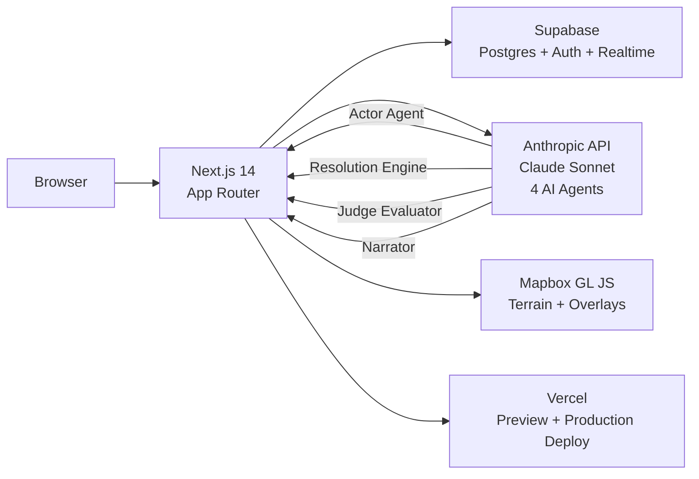

# GeoSim — Geopolitical Strategic Simulation

AI-powered simulation engine: load scenarios, watch AI actors resolve turns simultaneously, and fork timelines at key decision points.

**Live demo:** https://geosim-eight.vercel.app/


---

## Architecture



---

## Features

- **Iran crisis scenario** — 6 actors (US, Iran, Israel, Russia, China, Gulf States) with distinct objectives and doctrine
- **4 AI agent pipeline** — Actor Agent → Resolution Engine → Judge Evaluator → Narrator; all parallel via `Promise.all`
- **Fog of war** — each actor's intelligence picture filtered to their observable state via Supabase RLS
- **Git-like branching** — fork history at any turn node, navigate with `?commit=` URL routing
- **Escalation ladder** — 8-rung system from diplomatic engagement to nuclear threshold
- **Simultaneous turn resolution** — planning → resolution → reaction → judging → narration phases
- **Prompt caching** — stable system prompts cached; only variable turn data is fresh (reduces latency ~40%)
- **Mapbox GL terrain** — actor markers, chokepoint overlays, floating metric chips

---

## User Roles

| Role | Capabilities |
|---|---|
| **Observer** | Browse scenario hub, view chronicle, read actor intelligence reports |
| **Player** | Take control of an actor at any turn node, select from AI-generated decisions, fork the timeline |

---

## Local Setup

```bash
# Install dependencies (WSL2: use bun, not npm)
bun install

# Copy environment variables
cp .env.local.example .env.local
# Fill in: NEXT_PUBLIC_SUPABASE_URL, NEXT_PUBLIC_SUPABASE_ANON_KEY,
#          SUPABASE_SERVICE_ROLE_KEY, ANTHROPIC_API_KEY,
#          NEXT_PUBLIC_MAPBOX_TOKEN

# Start development server
bun run dev   # http://localhost:3000 (or 5000 in WSL2 config)

# Run tests
bun run test -- --run

# Type check
bun run typecheck

# Lint
bun run lint
```

---

## Tech Stack

| Layer | Technology |
|---|---|
| Framework | Next.js 14 App Router, TypeScript 5, React 18 |
| Styling | Tailwind CSS, Space Grotesk + Newsreader + IBM Plex Mono fonts |
| Database | Supabase (PostgreSQL + Auth + Realtime) |
| Map | Mapbox GL JS |
| AI | Anthropic API (Claude Sonnet), prompt caching |
| Testing | Vitest, @testing-library/react, Playwright |
| CI/CD | GitHub Actions, Vercel |

---

## Claude Code Extensibility

Built with a full Claude Code workflow — all configuration ships in `.claude/`:

| Feature | Count | Details |
|---|---|---|
| Custom skills | 14 | `quality-gate` (v2), `review-pr`, `security-audit`, `run-turn`, `seed-iran-scenario`, and 9 more |
| Hooks | 5 | PreToolUse secret protection, PostToolUse auto-format + test-on-save, SessionStart reminder, Stop uncommitted warning |
| MCP servers | 8 | context-mode, playwright, supabase, github, vercel, frontend-design, superpowers, claude-md-management |
| Agents | 1 | `code-reviewer` — worktree isolation, C.L.E.A.R. framework |
| Worktree PRs | 5 | Parallel feature development via git worktrees (#67, #69, #70, #73, #82) |

See `.mcp.json` for MCP server configuration and `.claude/settings.json` for hook configuration.

---

## CI Pipeline

Every PR triggers: **Typecheck → Lint → Unit Tests → Coverage → Security Audit → E2E Tests**

Vercel automatically posts preview deploy URLs to every PR. Production deploys on merge to `main`.

---

## Project Structure

```
app/                    — Next.js App Router pages and API routes
app/api/ai/             — AI agent endpoints (actor, resolution, judge, narrator)
app/api/scenarios/      — Scenario CRUD + research pipeline
app/api/nodes/          — Node-centric branch API (fork, navigate, decision options)
components/             — React components (ui/, game/, map/, panels/)
lib/game/               — Game loop, fog of war, escalation, state engine
lib/ai/                 — Prompt construction, API wrappers with prompt caching
lib/types/              — TypeScript types (database.ts, simulation.ts)
tests/                  — Vitest unit/integration/component + Playwright E2E
.claude/                — Skills, hooks, agents, MCP config
docs/                   — Architecture docs, sprint docs, standups, research
supabase/migrations/    — Database schema with RLS policies
```

---

## Team

Built by **Jason Ingersoll** and **Vartika** as Project 3 for the AI-assisted software engineering course.

- Jason: game logic, AI pipeline, branching architecture, Iran scenario research
- Vartika: frontend components, CI/CD, decision catalogs, auth, cost tracking
